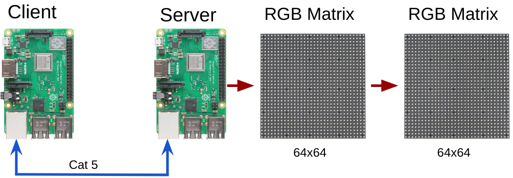
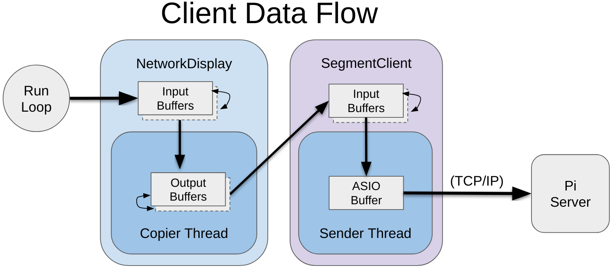
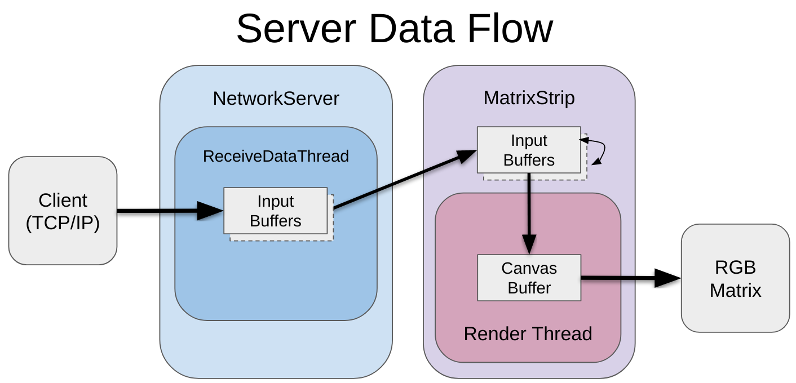
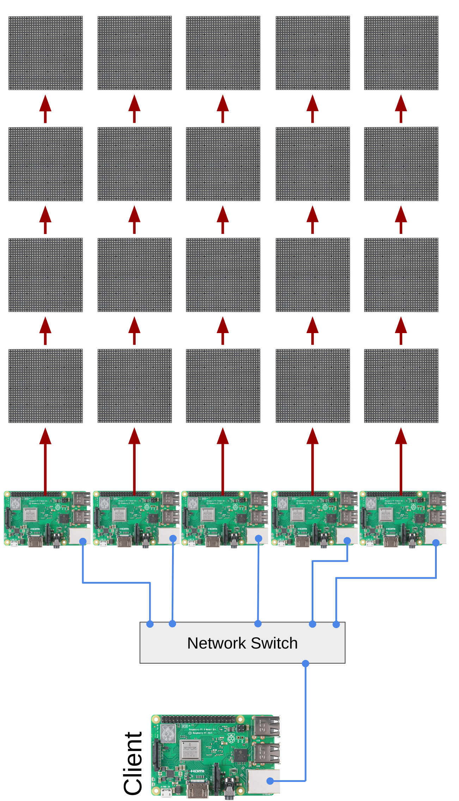

# How the Network Matrix Display works

Network Matrix Display is a set of libraries that allows you create a scalable network of matrix displays using Raspberry Pi Single Board Computers.  It does this by using TCIP/IP as a transport method for the display data and is broken into two discrete sections; Client and Server.  

## An important word on security
This library is designed for speed and thus does not use encryption by client or server libraries. The Server will run and listen on port 9890 and once it receives the right amount of information, it will happily display it. It is for these reasons that we **strongly advise** keeping these devices off of your network. It is only advised that you **temporarily** connect them to an network with internet access if for updates only. 

## Client & Server definition
A `Client` is responsible for generating the display data that will be sent to one or more `Servers` to display via their connected RGB Matrix panels. Utilizing this code base, there is only a single client and there can be on or more servers.

For networking, this project makes heavy use of [Boost ASIO library](https://www.boost.org/doc/libs/1_70_0/doc/html/boost_asio.html) and [Henner Zeller's](https://github.com/hzeller) [rpi-rgb-led-matrix library](https://github.com/hzeller/rpi-rgb-led-matrix) (server only).

*Note*: For speed and simplicity, the client and server code do not implement any sort of security (encryption, authentication, tokens, etc..) what-so-ever! It is advised that you execute this in environments with physical network separation from the internet!

Let's look at some use cases.

## Simple : one client, one server (single strip of panels)
This is the easiest of examples to imagine. You need to have one or more RGB Matrices fed via a remote source.  Here, you would need a computer to act as a client, a Raspberry Pi to act as a server and one or more RGB Matrices.  

The above image depicts a Pi acting in the role of a Client, but the truth is, any Linux or MacOS computer should work well.
This [YouTube video](https://www.youtube.com/watch?v=gTtBLEOPpsM) is a great demonstration of the complex version of this project running on a linux PC with three Pis acting as `Servers` (pardon the wiring mess 😉). 

### Client to server operation (Simple example)
In the above example, we have two RGB panels connected. Each panel is 64 pixels tall and 64 pixels wide (4,096 addressable pixels).  Given that we have two panels side-by-side, our entire display area is 128 pixels wide by 64 pixels tall, a total of addressable 8,192 pixels. 

__Client:__ The client is configured with the IP Addresses and Port of the Server. We also configure the client with the relevant display information; number of panels, dimensions of panels and how many "segments". Our current example only has a single segment, so we'll dive into that term a little later on.  For every execution of the run loop, we'll generate the necessary buffer data for the Server to display and shuttle it over to the sever via TCIP/IP. Here's an image that demonstrates how the client data flow operates.

The `Run Loop` is something that executes at a fixed interval to provide the necessary display data for the remote matrices (`Server`). 

In this example, our `Client` code would only spawn a single `Copier Thread` as there is only a single LED matrix segment to deal with.

It's worth noting that the Sender thread that executes on the segment client is non-blocking and failures to connect are graceful, thus non-impacting to your code.

__Server:__ The server is configured with the same information as the server, including the receiving port number.  The server looks similar to the Client with a few exceptions.  

The `NetworkServer` class spawns a thread (`ReceiveDataThread`) and implements `Boost ASIO` and patiently waits (blocking) for TCP/IP connections from the client.  After data is received from the client, the data is copied to an instance of `MatrixStrip`, which extends the `rpi-rgb-led-matrix` library's `ThreadedCanvasManipulator` class, and implements double buffering to ensure we don't block the render thread (`ThreadedCanvasManipulator::Run()`) as blocking this function will cause the LED panels to flicker.

## Complex : one client, many servers, many panels
This project's architecture can scale much greater than a few panels on a few displays.  The following image depicts an example project where we need to provide enough pixel surface area for a 320 x 240 display.

This example works similarly to the the Client to Server communication explanation above, except for each Strip, an instance of the `SegmentClient` is instantiated, each with a specific target `Server` in mind.

We use these many RaspberryPis because driving RGB LED Matrices is a CPU intensive process and the RasbperryPi 3b+ has limitations with RAM (~900Mhz) and I2S Bus Speeds and with our experimentation, found that 16,384 LEDs is as many as the device can drive without beginning to impact usability with significant flickering. 

The Server Raspberry Pis connect to the Matrices via a daughter board that neatly exposes the GPIO pins in HUB75 arrangement and also includes much needed 3.3V to 5V level shifters.

### Flipping the image
If you peek at the wiring guide below, you'll see that the `rpi-rgb-led-matrix` wiring diagram has the Raspberry Pi to the Right of the Matrices, making the origin of the screens the top left corner of the collection of Matrices.  To make our project work as we wish, we orient the buffer data flipping the image data 90 degrees clockwise. 

# Examples in action
At the time of this writing, there is one [simple client example](../client/examples/simple.cpp) simply fills the displays with slid transitioning colors as a demonstration of execution. 

Other examples include our [LaiNES emulator](https://github.com/jaygarcia/LaiNES-with-network-display) offline work.  To get this to run, you'll need to replicate the [complex hardware setup](https://github.com/jaygarcia/LaiNES-with-network-display/md/Hardware.md). Be aware that LaiNES is a limited emulator and has some compatibility issues with some ROMS.
 

## Panel data wiring guide

Henner has a great [wiring guide](https://github.com/hzeller/rpi-rgb-led-matrix/blob/master/wiring.md) in his repository and it's worth reading.  It's very detailed, but it helps you wrap your mind around how the Pi is able to display data on the matrices. 

**(Henner's wiring guide image)*

If you're going run parallel chains of matrices, they must be a multiple of that parallel chain. In other words, if you're doing three parallel chains of matrices, you cannot have five total RGB Matrices.

## General requirements 
- Good knowledge in C++
- Basic understanding of how RGB Matrices work
- Parts for your project

## Client Requirements:
- [LibBoost 1.7.0](https://dl.bintray.com/boostorg/release/1.70.0/source/boost_1_70_0.tar.gz)
- [CMake 3.14+](https://github.com/Kitware/CMake/releases/download/v3.14.4/cmake-3.14.4.tar.gz)
- [SDL2 (optional)](https://www.libsdl.org/download-2.0.php)

## Server Requirements
- [LibBoost 1.7.0](https://dl.bintray.com/boostorg/release/1.70.0/source/boost_1_70_0.tar.gz)
- [CMake 3.14+](https://github.com/Kitware/CMake/releases/download/v3.14.4/cmake-3.14.4.tar.gz)
- [rpi-rgb-led-matrix library](https://github.com/hzeller/rpi-rgb-led-matrix)
- [DietPi or similar light-weight linux distribution](https://dietpi.com/)
- [Raspberry Pi 2 or greater SBC](https://www.raspberrypi.org/products/raspberry-pi-3-model-b-plus/)
- [Electro Dragon RGB Panel driver board](https://www.electrodragon.com/product/rgb-matrix-panel-drive-board-raspberry-pi/) (*recommended*)
- [1+ RGB Matrices](https://www.adafruit.com/product/420)

## Additional hardware
- Gigabit Network switch (*wifi is too slow*)
- Frame for your matrix
- Power supplies for your SBCs
- Power supply for your RGB Matrix

